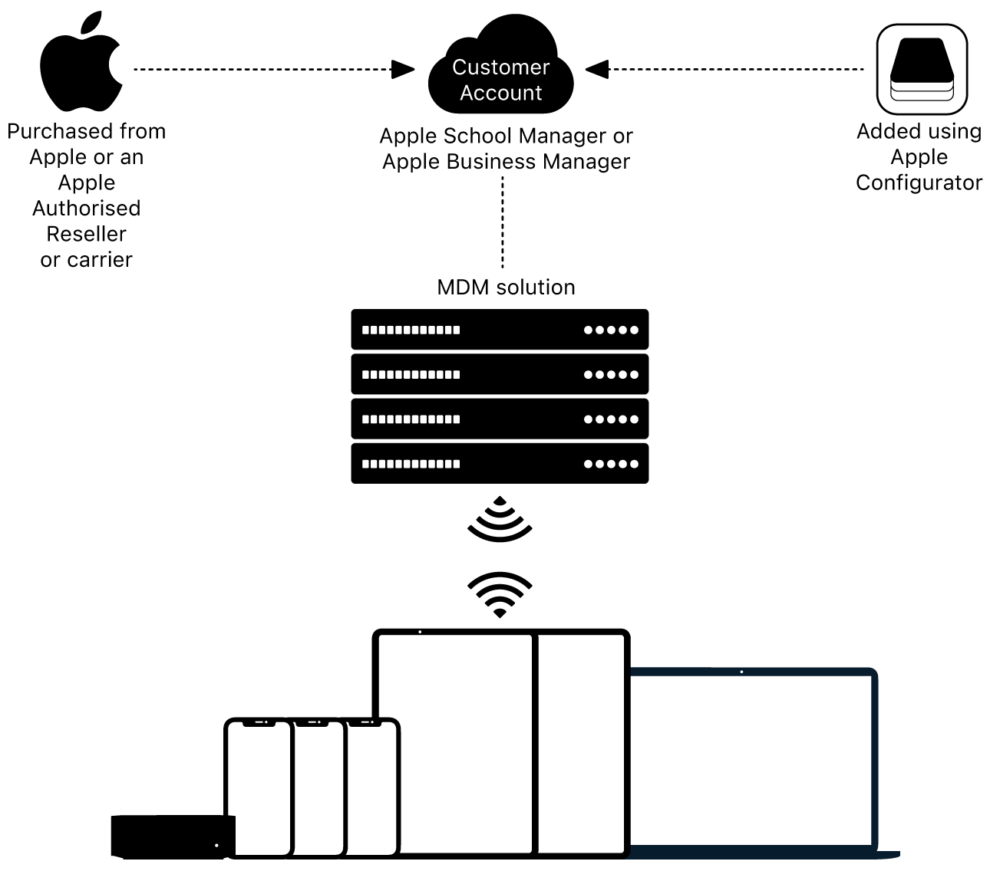

# Apple School Manager
{:.no_toc}

1. TOC
{:toc}

---

## What is Apple School Manager

Apple School Manager (ASM) is a web-based platform for IT administrators to manage Apple devices, create Managed Apple IDs, and streamline device deployment for educational institutions. ASM integrates with your Mobile Device Management (MDM) solution, like Jamf, allowing seamless configuration and distribution of devices and apps.

Using ASM, you can:

1. Enroll devices automatically during setup, reducing manual configuration.
2. Create and assign Managed Apple IDs to students and staff.
3. Procure and assign app licenses directly to devices or user groups.

Though for our use cases we mostly use ASM for 1 and 3.

---

## Steps for Adding a Device

To add a new device to Apple School Manager and assign it for management through Jamf, follow these steps:

1. **Log into Apple School Manager**  
   Go to [Apple School Manager](https://school.apple.com/) and sign in with your admin credentials.

   {: .note }
   >**ASM does not work on Firefox**

2. **Navigate to Device Assignments**  
   In the ASM dashboard, go to *Devices*. Here, you can add newly acquired devices for management.

   

3. **Enter Device Serial Numbers or Order Numbers**  
   Enter the serial numbers of each new device, or upload a CSV file with multiple serial numbers. Alternatively, you can assign devices based on the order number from the Apple Store.

4. **Assign Devices to MDM Server**  
   Once devices are registered, assign them to the Jamf MDM server. This step ensures that during device setup, they will automatically enroll in Jamf for management.
   
   

5. **Verify Device Status in Jamf**  
   After assigning devices in ASM, check the Jamf console to confirm that the devices appear and are ready for configuration goto *Computers > PreStage Enrollments > CBE > Scope*. Ensure that the newly added device is assigned and scoped. This process may take a few minutes to synchronize.
   

---

## Steps for Procurement of App Licenses from Apple App Store

To acquire app licenses for your organization and distribute them through Apple School Manager, follow these steps:

1. **Access the Apps and Books Section**  
   In ASM, go to *Apps and Books*. This section lets you browse available apps and purchase licenses for distribution.

2. **Search for Required Applications**  
   Use the search bar to find specific apps needed for your institution. **Make sure that your search is filtered to Type: Mac** Verify that the app supports volume purchasing if you require multiple licenses.

3. **Select the License Quantity and Payment Method**  
   Choose the number of licenses you need, then select the payment method (credit card or purchase order). Ensure the purchase aligns with budget allocations.
   
4. **Assign Licenses to MDM Server**  
   After purchasing, assign the app licenses to the Jamf MDM server. This assignment makes them available for deployment directly through Jamf.

5. **Deploy Apps via Jamf**  
   In Jamf, goto *Settings > Volume Purchasing > College of Built Environments > Content* and verify that the newly added Apple App Store app has been added to Jamf. Go to *Computers > Mac Apps > App Store > New > Mac App Store* to search for scope and deploy the licensed apps to the appropriate devices or user groups. Confirm the apps install successfully on managed devices.
   

   

